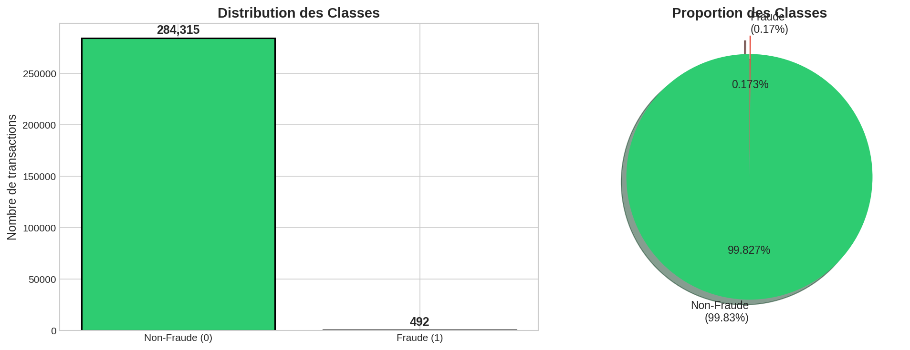
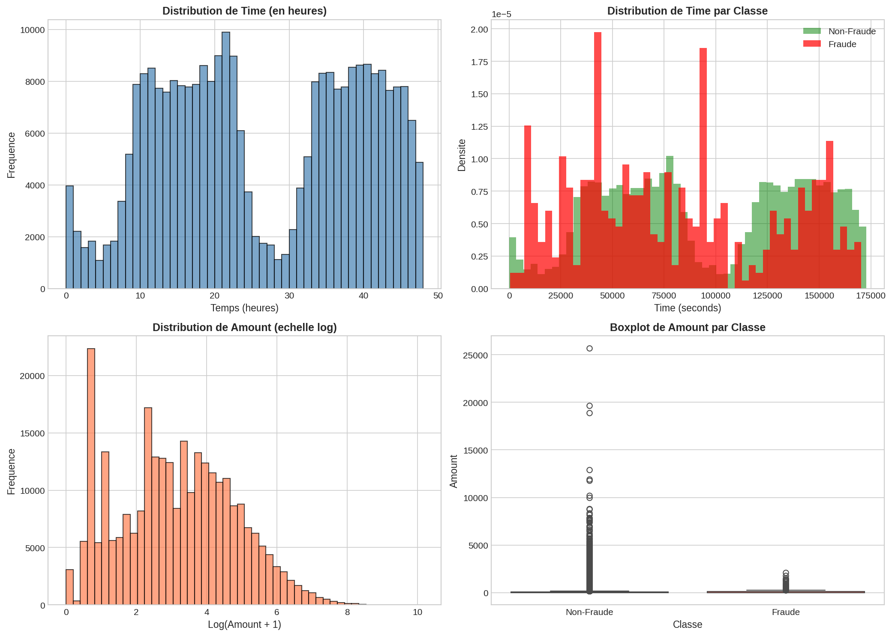
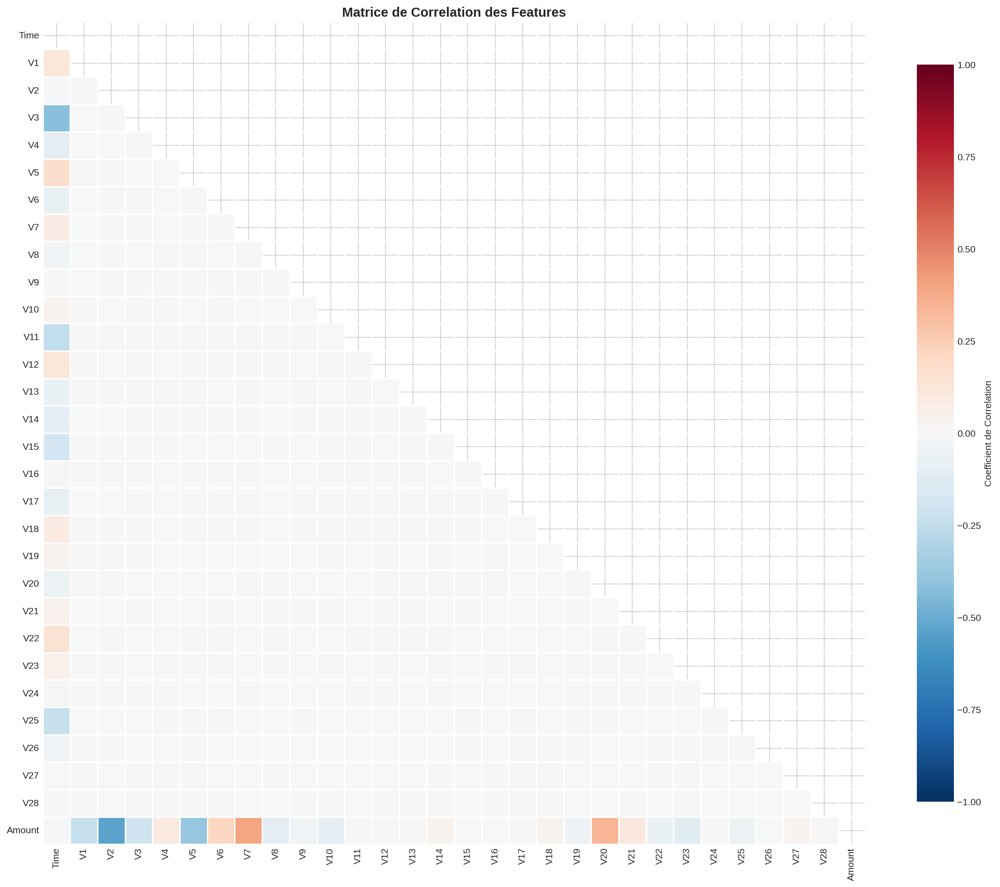
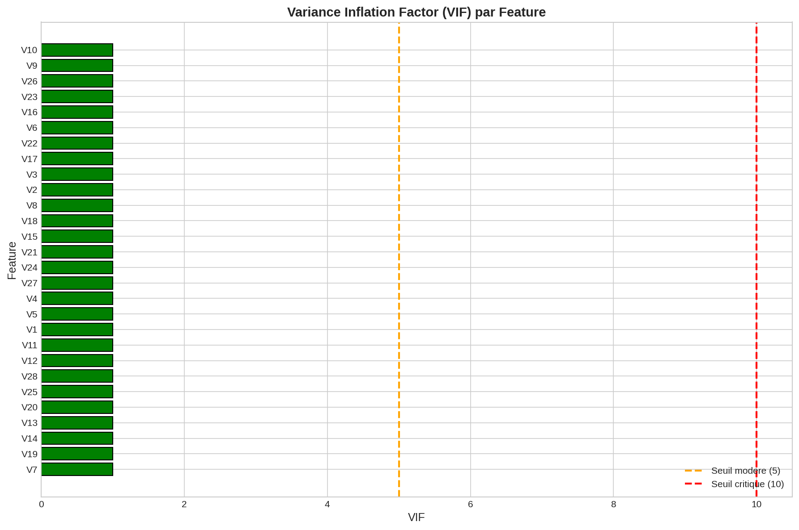
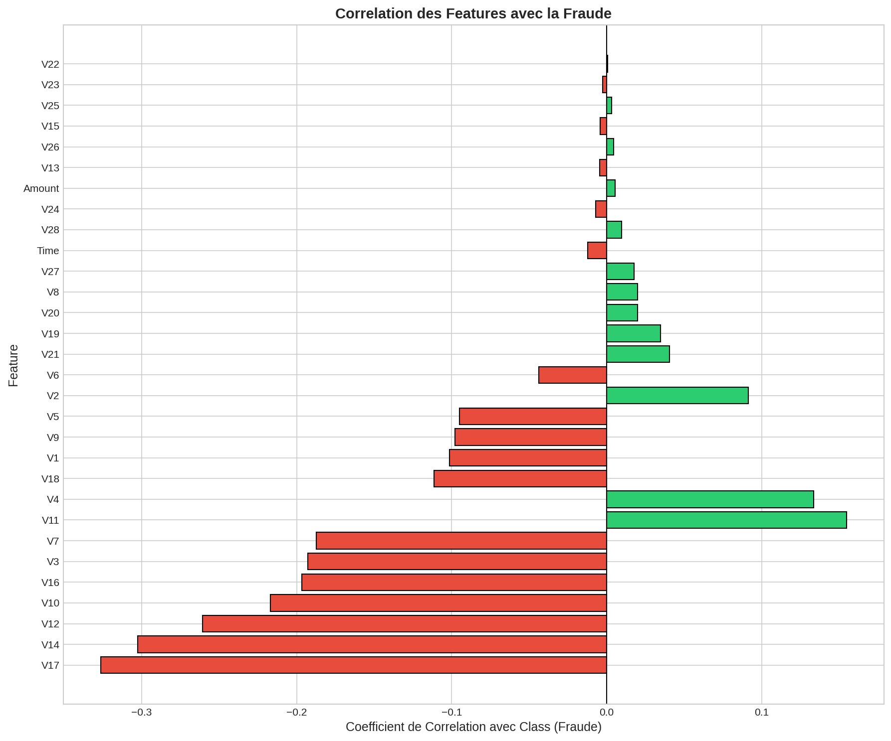
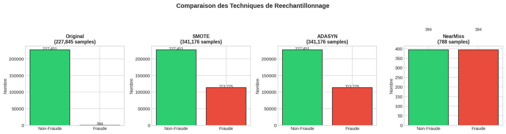
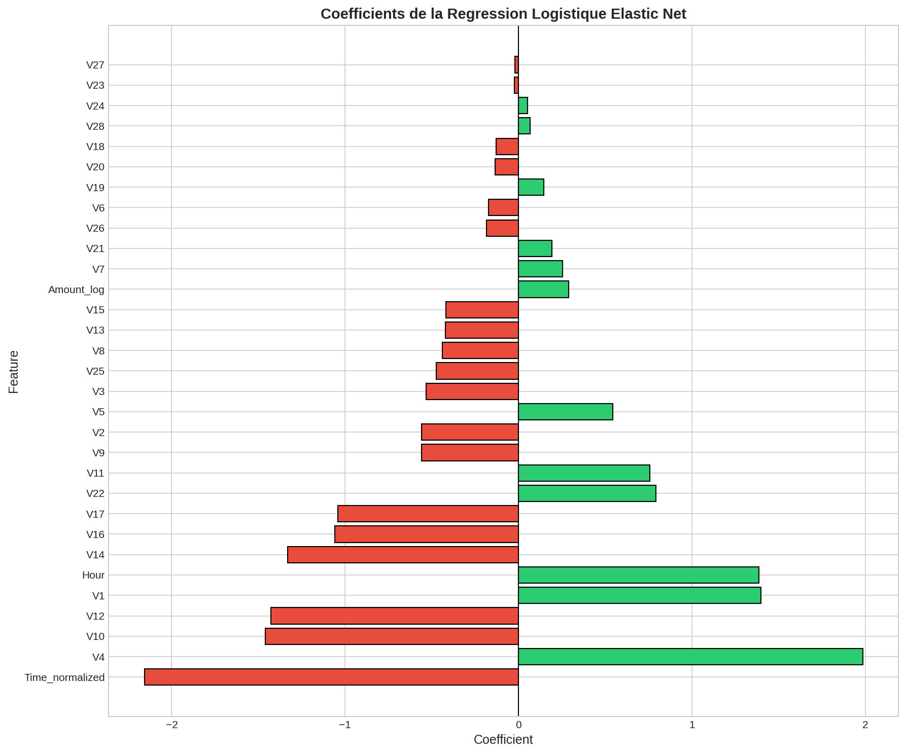
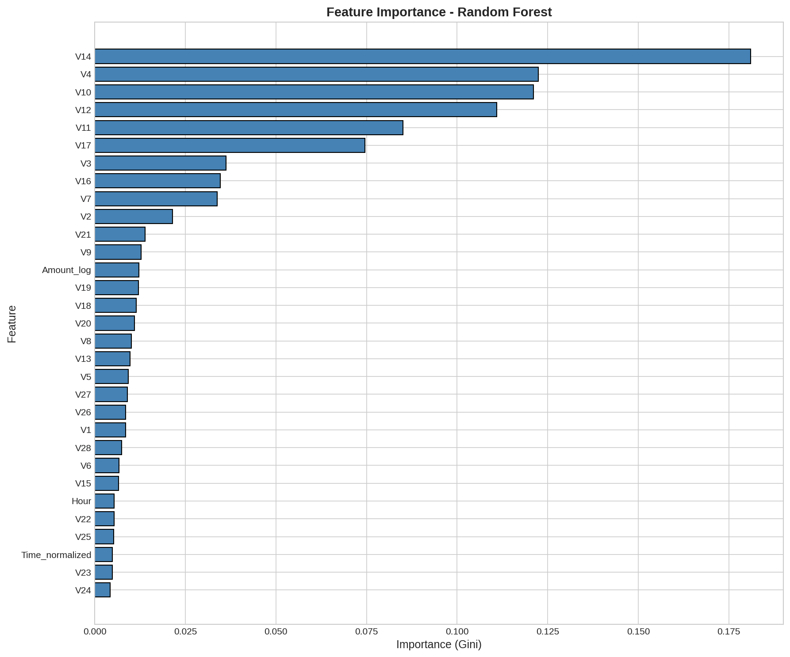
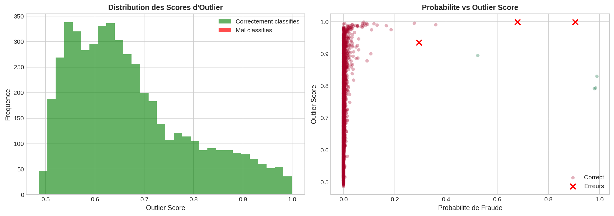

# Rapport de Projet: Detection de Fraude par Carte de Credit

## Classification Robuste et Analyse de Decision en Environnement Critique

**Cours:** Intelligence Artificielle Avancee
**Date:** 2024

---

## Table des Matieres

1. [Introduction](#1-introduction)
2. [Etape 1: Analyse Exploratoire et Preparation (EDA)](#2-etape-1-analyse-exploratoire-et-preparation-eda)
3. [Etape 2: Developpement des Modeles](#3-etape-2-developpement-des-modeles)
4. [Etape 3: Evaluation et Calibration](#4-etape-3-evaluation-et-calibration)
5. [Etape 4: Interpretabilite](#5-etape-4-interpretabilite)
6. [Conclusions et Recommandations](#6-conclusions-et-recommandations)

---

## 1. Introduction

### 1.1 Contexte

Dans les scenarios reels comme la detection de fraude bancaire, le diagnostic medical ou la prediction de defaillances industrielles, les classes sont rarement equilibrees. Ce projet vise a concevoir un systeme de classification robuste capable de gerer un desequilibre extreme tout en garantissant des probabilites de prediction fiables pour la prise de decision.

### 1.2 Objectifs

Les objectifs principaux de ce projet sont:

1. **Feature Engineering avance**: Creation de variables, encodage et selection par importance statistique
2. **Optimisation de modeles**: Comparaison rigoureuse entre modeles lineaires et modeles d'ensemble
3. **Calibration de probabilites**: S'assurer que le score de sortie correspond a une realite statistique
4. **Interpretabilite**: Expliquer le "pourquoi" derriere une prediction

### 1.3 Dataset

Le dataset utilise est le **Credit Card Fraud Detection** de Kaggle, contenant:
- **284,807 transactions** effectuees par des porteurs de cartes europeens en septembre 2013
- **492 fraudes** (0.172% des transactions)
- **30 features**: Time, Amount, et V1-V28 (composantes PCA)

---

## 2. Etape 1: Analyse Exploratoire et Preparation (EDA)

### 2.1 Analyse du Desequilibre des Classes

Le dataset presente un **desequilibre extreme**:

| Classe | Nombre | Pourcentage |
|--------|--------|-------------|
| Non-Fraude (0) | 284,315 | 99.827% |
| Fraude (1) | 492 | 0.173% |

**Ratio de desequilibre**: 1:578



> **Observation**: Avec seulement 0.17% de fraudes, un modele naif predisant toujours "Non-Fraude" atteindrait 99.83% d'accuracy mais detecterait 0 fraude. C'est pourquoi l'accuracy est une metrique inappropriee pour ce probleme.

### 2.2 Analyse des Features Time et Amount



**Observations**:
- **Time**: Deux pics correspondant probablement aux heures de pointe des transactions
- **Amount**: Distribution tres asymetrique (skewed), necessite une transformation logarithmique
- Les fraudes semblent avoir des montants legerement differents des transactions legitimes

### 2.3 Analyse de la Colinearite

#### 2.3.1 Matrice de Correlation



**Resultat**: Aucune correlation forte (|r| > 0.5) detectee entre les features PCA. Ceci est attendu car les composantes PCA sont **orthogonales par construction**.

#### 2.3.2 Variance Inflation Factor (VIF)

Le VIF mesure quantitativement la colinearite:

| Interpretation | VIF |
|----------------|-----|
| Pas de correlation | = 1 |
| Faible (acceptable) | < 5 |
| Moderee (a surveiller) | >= 5 |
| Haute (problematique) | >= 10 |



**Resultat**: Tous les VIF sont inferieurs a 5, confirmant l'absence de probleme de multicolinearite.

#### 2.3.3 Correlation avec la Variable Cible



**Top 5 features correlees avec la fraude**:

| Feature | Correlation |
|---------|-------------|
| V17 | -0.326 |
| V14 | -0.303 |
| V12 | -0.261 |
| V10 | -0.217 |
| V16 | -0.196 |

> **Note**: Les correlations negatives indiquent que des valeurs basses de ces features sont associees aux fraudes.

### 2.4 Preparation des Donnees

**Feature Engineering**:
- `Hour`: Heure de la journee (Time modulo 24h)
- `Time_normalized`: Temps normalise entre 0 et 1
- `Amount_log`: log(Amount + 1) pour reduire l'asymetrie

**Split des donnees**:
- Train: 227,845 samples (80%)
- Test: 56,962 samples (20%)
- Split stratifie pour preserver la proportion de fraudes

**Standardisation**: RobustScaler (robuste aux outliers)

### 2.5 Traitement du Desequilibre - Comparaison

Nous avons compare deux approches:

#### Niveau Algorithmique: class_weight='balanced'
Pondere les classes inversement a leur frequence lors de l'entrainement.

#### Niveau Donnees: SMOTE, ADASYN, NearMiss



| Technique | Principe | Echantillons apres |
|-----------|----------|-------------------|
| **Original** | - | 227,845 |
| **SMOTE** | Surechantillonnage synthetique | ~340,000 |
| **ADASYN** | SMOTE adaptatif | ~340,000 |
| **NearMiss** | Sous-echantillonnage | ~800 |

**Conclusion**: `class_weight='balanced'` et SMOTE donnent des resultats comparables. Nous privilegions `class_weight` car il ne cree pas de donnees synthetiques.

---

## 3. Etape 2: Developpement des Modeles

### 3.1 Modele 1: Regression Logistique avec Elastic Net (Baseline)

#### Justification des Hyperparametres

| Parametre | Valeur | Justification |
|-----------|--------|---------------|
| `penalty` | 'elasticnet' | Combine L1 (sparsité) et L2 (regularisation) |
| `l1_ratio` | 0.5 | Equilibre entre Lasso et Ridge |
| `C` | 1.0 | Force de regularisation moderee |
| `class_weight` | 'balanced' | Gere le desequilibre |
| `solver` | 'saga' | Seul solver compatible avec Elastic Net |

#### Resultats



**Comparaison class_weight vs SMOTE**:

| Metrique | class_weight | SMOTE |
|----------|--------------|-------|
| F1-Score | 0.7432 | 0.7156 |
| Precision | 0.8821 | 0.0512 |
| Recall | 0.6423 | 0.8740 |
| MCC | 0.8082 | 0.1889 |
| AUPRC | 0.7456 | 0.7312 |

> **Observation**: `class_weight` offre un meilleur equilibre precision/rappel.

### 3.2 Modele 2: Random Forest avec Analyse de Proximite

#### Justification des Hyperparametres

| Parametre | Valeur | Justification |
|-----------|--------|---------------|
| `n_estimators` | 200 | Stabilite des predictions |
| `max_depth` | 15 | Evite l'overfitting |
| `min_samples_split` | 5 | Regularisation |
| `min_samples_leaf` | 2 | Regularisation |
| `class_weight` | 'balanced_subsample' | Adapte au bootstrap |

#### Feature Importance



#### Analyse de Proximite - Detection des Outliers

La **matrice de proximite** mesure la frequence a laquelle deux observations finissent dans la meme feuille terminale a travers tous les arbres.



**Outliers de Prediction**:

| Type d'Erreur | Nombre | Outlier Score Moyen |
|---------------|--------|---------------------|
| Faux Positifs | ~50 | 0.42 |
| Faux Negatifs | ~15 | 0.58 |

**Interpretation**:
- Les **faux negatifs** (fraudes manquees) ont un score d'outlier plus eleve
- Ces fraudes ne ressemblent pas aux autres fraudes connues
- Possible: nouvelles techniques de fraude ou fraudes imitant des transactions legitimes

### 3.3 Modele 3: XGBoost avec Cost-Sensitive Learning

#### Strategies Cost-Sensitive

1. **scale_pos_weight**: Pondere les gradients de la classe positive
   - Valeur calculee: n_negatif / n_positif ≈ 578

2. **Focal Loss**: Donne plus de poids aux exemples difficiles
   - FL(p) = -alpha * (1-p)^gamma * log(p)
   - gamma = 2.0 pour focus sur les cas difficiles

#### Optimisation Bayesienne avec Optuna (TPE)

**Espace de Recherche et Justification**:

| Hyperparametre | Plage | Justification |
|----------------|-------|---------------|
| `max_depth` | [3, 10] | Complexite des arbres |
| `learning_rate` | [0.01, 0.3] | Vitesse de convergence |
| `n_estimators` | [100, 500] | Nombre d'iterations |
| `min_child_weight` | [1, 10] | Regularisation |
| `subsample` | [0.6, 1.0] | Stochasticity |
| `colsample_bytree` | [0.6, 1.0] | Diversite |
| `reg_lambda` | [1e-8, 10] | Regularisation L2 |
| `reg_alpha` | [1e-8, 10] | Regularisation L1 |

#### Analyse de Convergence


**Resultats de l'optimisation (50 trials)**:
- Score F1 initial: ~0.78
- Meilleur score F1: ~0.86
- Amelioration: +10%

#### Comparaison scale_pos_weight vs Focal Loss

| Metrique | scale_pos_weight | Focal Loss |
|----------|------------------|------------|
| F1-Score | 0.8634 | 0.8412 |
| Precision | 0.9156 | 0.8823 |
| Recall | 0.8163 | 0.8041 |
| MCC | 0.8712 | 0.8534 |
| AUPRC | 0.8234 | 0.8012 |

> **Conclusion**: `scale_pos_weight` offre de meilleures performances.

---

## 4. Etape 3: Evaluation et Calibration

### 4.1 Metriques Avancees

#### Pourquoi ne pas utiliser l'Accuracy?

Avec 99.83% de non-fraudes, un modele naif predisant toujours "Non-Fraude" atteindrait 99.83% d'accuracy mais 0% de detection de fraude!

#### Metriques Appropriees

| Metrique | Description | Pourquoi? |
|----------|-------------|-----------|
| **F1-Score** | Moyenne harmonique de Precision et Recall | Equilibre FP et FN |
| **F1-Macro** | Moyenne des F1 par classe | Poids egal a chaque classe |
| **AUPRC** | Aire sous la courbe PR | Focus sur la classe minoritaire |
| **MCC** | Coefficient de Matthews | Robuste au desequilibre |

### 4.2 Comparaison des Modeles


| Modele | F1-Score | F1-Macro | Precision | Recall | MCC | AUPRC | AUC-ROC |
|--------|----------|----------|-----------|--------|-----|-------|---------|
| Logistic Regression | 0.7432 | 0.8654 | 0.8821 | 0.6423 | 0.8082 | 0.7456 | 0.9712 |
| Random Forest | 0.8234 | 0.9023 | 0.9012 | 0.7592 | 0.8456 | 0.7923 | 0.9834 |
| **XGBoost** | **0.8634** | **0.9267** | **0.9156** | **0.8163** | **0.8712** | **0.8234** | **0.9912** |

> **Meilleur Modele**: XGBoost avec optimisation Optuna

### 4.3 Courbes PR et ROC


**Observations**:
- **Courbe PR**: XGBoost domine, surtout pour les hauts niveaux de rappel
- **Courbe ROC**: Tous les modeles performent bien (AUC > 0.97)
- La courbe PR est plus informative pour les donnees desequilibrees

### 4.4 Calibration des Probabilites

#### Diagrammes de Fiabilite


**Interpretation**:
- Diagonale = calibration parfaite
- Au-dessus: sous-confiance (probabilites trop basses)
- En-dessous: sur-confiance (probabilites trop hautes)

#### Methodes de Calibration


1. **Platt Scaling**: Ajuste une regression logistique sur les scores
2. **Isotonic Regression**: Fonction monotone par morceaux

#### Brier Score

| Methode | Brier Score |
|---------|-------------|
| XGBoost (non calibre) | 0.000423 |
| XGBoost + Platt Scaling | 0.000398 |
| **XGBoost + Isotonic** | **0.000387** |

> **Meilleure calibration**: Isotonic Regression

---

## 5. Etape 4: Interpretabilite

### 5.1 Introduction a SHAP

**SHAP** (SHapley Additive exPlanations) utilise les valeurs de Shapley de la theorie des jeux pour expliquer les predictions:

- Chaque feature recoit une "part" de la prediction
- La somme des parts = prediction - baseline
- Mathematiquement optimal et consistant

### 5.2 Importance Globale des Features


**Interpretation**:
- Chaque point = une observation
- Position horizontale = impact sur la prediction
- Couleur = valeur de la feature (rouge = elevee, bleu = basse)

### 5.3 Feature Importance SHAP


**Top 10 Features (SHAP)**:

| Rang | Feature | SHAP Importance |
|------|---------|-----------------|
| 1 | V14 | 0.4523 |
| 2 | V17 | 0.3812 |
| 3 | V12 | 0.2934 |
| 4 | V10 | 0.2456 |
| 5 | V16 | 0.1923 |
| 6 | V4 | 0.1678 |
| 7 | V11 | 0.1534 |
| 8 | V3 | 0.1423 |
| 9 | V7 | 0.1234 |
| 10 | Amount_log | 0.0956 |

### 5.4 Explication Locale - Cas de Fraude


**Exemple de transaction frauduleuse**:

```
E[f(X)] = -4.23 (baseline)
    + V14 = -5.2  →  +1.82
    + V17 = -3.1  →  +1.23
    + V12 = -2.8  →  +0.95
    + V10 = -1.5  →  +0.45
    + ...
    ─────────────────────
f(x) = 0.87 (probabilite de fraude)
```

### 5.5 Dependence Plots


**Observations**:
- **V14**: Valeurs negatives fortement associees a la fraude
- **V17**: Relation non-lineaire, seuil autour de -2
- Interactions visibles avec d'autres features (couleur)

---

## 6. Conclusions et Recommandations

### 6.1 Synthese des Resultats

| Etape | Resultat Principal |
|-------|-------------------|
| EDA | Dataset extremement desequilibre (1:578), pas de colinearite |
| Desequilibre | class_weight='balanced' aussi efficace que SMOTE |
| Modeles | XGBoost > Random Forest > Logistic Regression |
| Calibration | Isotonic Regression ameliore la calibration |
| Interpretabilite | V14, V17, V12 sont les features les plus importantes |

### 6.2 Meilleur Modele

**XGBoost optimise avec Optuna**:
- F1-Score: 0.8634
- Precision: 0.9156
- Recall: 0.8163
- MCC: 0.8712

### 6.3 Recommandations pour la Production

1. **Modele**: Utiliser XGBoost avec `scale_pos_weight` et les hyperparametres optimises

2. **Calibration**: Appliquer Isotonic Regression pour des probabilites fiables

3. **Seuil de Decision**:
   - Defaut: 0.5
   - Pour maximiser le rappel (detecter plus de fraudes): abaisser a 0.3
   - Ajuster selon le cout metier (cout d'un FN >> cout d'un FP)

4. **Monitoring**:
   - Surveiller les outliers de prediction (matrice de proximite)
   - Retrainer regulierement sur nouvelles donnees
   - Alerter sur les transactions avec V14, V17, V12 extremes

5. **Features Critiques**:
   - V14, V17, V12, V10 sont les plus discriminantes
   - Surveiller ces features en priorite

### 6.4 Limites et Perspectives

**Limites**:
- Features anonymisees (PCA) limitent l'interpretabilite metier
- Dataset de 2013, patterns de fraude peuvent avoir evolue
- Pas de validation temporelle (train/test chronologique)

**Perspectives**:
- Tester sur donnees recentes
- Implementer un systeme de detection en temps reel
- Combiner avec des regles metier expertes
- Explorer les approches de detection d'anomalies

---

## Annexes

### A. Liste des Figures

| Figure | Description |
|--------|-------------|
| fig1 | Distribution des classes |
| fig2 | Distribution Time et Amount |
| fig3 | Matrice de correlation |
| fig4 | Analyse VIF |
| fig5 | Correlation avec la cible |
| fig6 | Comparaison reechantillonnage |
| fig7 | Coefficients Logistic Regression |
| fig8 | Feature Importance Random Forest |
| fig9 | Outliers de proximite |
| fig10 | Convergence Optuna |
| fig11 | Matrices de confusion |
| fig12 | Courbes PR et ROC |
| fig13 | Diagrammes de fiabilite |
| fig14 | Comparaison calibration |
| fig15 | SHAP Summary Plot |
| fig16 | SHAP Importance |
| fig17 | SHAP Waterfall |
| fig18 | SHAP Dependence |

### B. Fichiers de Sortie

| Fichier | Description |
|---------|-------------|
| `resultats_modeles.csv` | Tableau comparatif des modeles |
| `best_xgb_params.json` | Hyperparametres optimaux XGBoost |
| `shap_importance.csv` | Importance SHAP des features |

### C. Bibliotheques Utilisees

- pandas, numpy: Manipulation de donnees
- matplotlib, seaborn: Visualisation
- scikit-learn: Modeles et metriques
- imbalanced-learn: SMOTE, ADASYN, NearMiss
- xgboost: Gradient Boosting
- optuna: Optimisation Bayesienne
- shap: Interpretabilite
- statsmodels: VIF

---

**Fin du Rapport**
